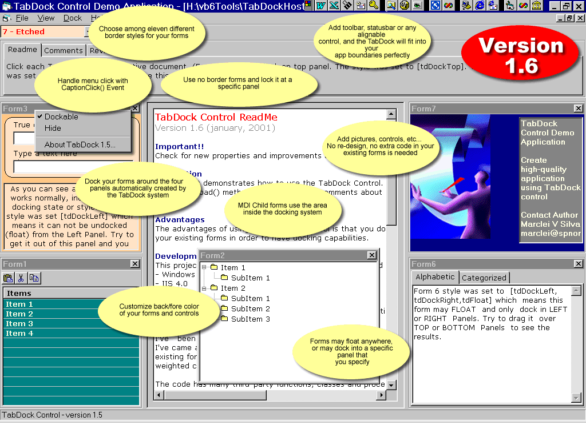



## TabDock Control version 1\.6

### Description

VERSION 1.6 RELEASED! New features and enhancements. This control allow form docking capabilities. The advantages of using the TabDock and TabDockHost is that you don't have to re-design or change any line of code of your existing forms in order to have docking capabilities.
 
### More Info
 
This control was created and compiled with VB6. It will no run in VB5 unless you change vb6 references in the project.

This control use SubClassing to handle several tasks, so before running the demo project you will need to download and install

the SSubTmr6.dll from <a href "http://www.vbaccelerator.com">www.vbaccelerator.com</a> web site.

Please run the Demo project and read the Revisions file which is shipped with this project before taking any action!

This control use subclassing and this may interfere when running in the VB IDE, so you may experience some vb hang ups when debugging the application.

             |
---                |---
**Submitted On**   |2001-01-14 17:12:46
**By**             |[Marclei V Silva](https://github.com/Planet-Source-Code/PSCIndex/blob/master/ByAuthor/marclei-v-silva.md)
**Level**          |Advanced
**User Rating**    |4.8 (205 globes from 43 users)
**Compatibility**  |VB 6\.0
**Category**       |[Custom Controls/ Forms/  Menus](https://github.com/Planet-Source-Code/PSCIndex/blob/master/ByCategory/custom-controls-forms-menus__1-4.md)
**World**          |[Visual Basic](https://github.com/Planet-Source-Code/PSCIndex/blob/master/ByWorld/visual-basic.md)
**Archive File**   |[CODE\_UPLOAD137791142001\.zip](https://github.com/Planet-Source-Code/marclei-v-silva-tabdock-control-version-1-6__1-7990/archive/master.zip)

### API Declarations

many, but don't be afraid!

